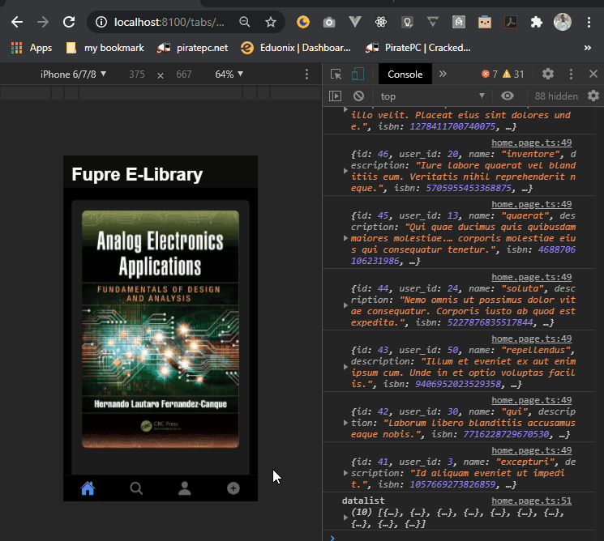

# library
An Ionic(Angular) App that uses libraryAPI(laravel - https://github.com/ereyomi/libraryApi ) built by me


## Setup / Installation app locally

1. Download and install [git](https://git-scm.com/)

2. Clone project

```bash
    > git clone https://github.com/ereyomi/library
```

3. cd into directory and run the command beow to Install Dependencies

```bash
    > npm install
```

4. Run the app

```bash
	> ng run
```


## Development server

Run `ng serve` for a dev server. Navigate to `http://localhost:4200/`. The app will automatically reload if you change any of the source files.

## Build

Run `ng build` to build the project. The build artifacts will be stored in the `dist/` directory. Use the `--prod` flag for a production build.